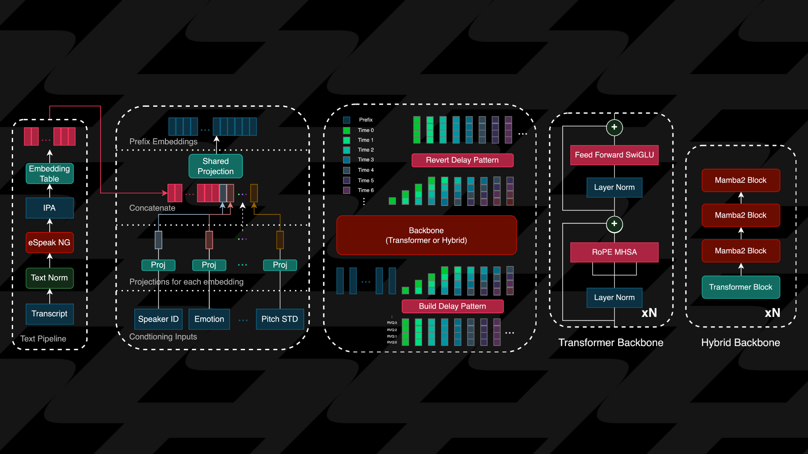

# Zonos-v0.1

<div align="center">

</div>

Zonos-v0.1 is a leading open-weight text-to-speech model, delivering expressiveness and quality on par with—or even surpassing—top TTS providers.

It enables highly naturalistic speech generation from text prompts when given a speaker embedding or audio prefix. With just 5 to 30 seconds of speech, Zonos can achieve high-fidelity voice cloning. It also allows conditioning based on speaking rate, pitch variation, audio quality, and emotions such as sadness, fear, anger, happiness, and joy. The model outputs speech natively at 44kHz.

Trained on approximately 200,000 hours of primarily English speech data, Zonos follows a straightforward architecture: text normalization and phonemization via eSpeak, followed by DAC token prediction through a transformer or hybrid backbone. An architecture overview can be seen below.

<div align="center">

</div>

Read more about our models [here](https://www.zyphra.com/post/beta-release-of-zonos-v0-1).

## Features
* Zero-shot TTS with voice cloning: Input desired text and a 10-30s speaker sample to generate high quality TTS output
* Audio prefix inputs: Add text plus an audio prefix for even richer speaker matching. Audio prefixes can be used to elicit behaviours such as whispering which are challenging to obtain from pure voice cloning
* Multilingual support: Zonos-v0.1 supports English, Japanese, Chinese, French, and German
* Audio quality and emotion control: Zonos offers fine-grained control of many aspects of the generated audio. These include speaking rate, pitch, maximum frequency, audio quality, and various emotions such as happiness, anger, sadness, and fear.
* Fast: our model runs with a real-time factor of ~2x on an RTX 4090
* WebUI gradio interface: Zonos comes packaged with an easy to use gradio interface to generate speech 
* Simple installation and deployment: Zonos can be installed and deployed simply using the docker file packaged with our repository.


## Docker Installation

```bash
git clone git@github.com:Zyphra/Zonos.git
cd Zonos

# For gradio
docker compose up

# Or for development you can do
docker build -t Zonos .
docker run -it --gpus=all --net=host -v /path/to/Zonos:/Zonos -t Zonos
cd /Zonos
python3 sample.py # this will generate a sample.wav in /Zonos
```

## DIY Installation
### eSpeak

```bash
apt install espeak-ng
```

### Python dependencies

Make sure you have a recent version of [uv](https://docs.astral.sh/uv/#installation), then run the following commands in sequence:

```bash
uv venv
uv sync --no-group main
uv sync
```

## Usage example

```bash
Python3 sample.py
```
This will produce `sample.wav` in the `Zonos` directory.

## Getting started with Zonos in python
Once you have Zonos installed try generating audio programmatically in python
```python3
import torch
import torchaudio
from zonos.model import Zonos
from zonos.conditioning import make_cond_dict

# Use the hybrid with "Zyphra/Zonos-v0.1-hybrid"
model = Zonos.from_pretrained("Zyphra/Zonos-v0.1-transformer", device="cuda")
model.bfloat16()

wav, sampling_rate = torchaudio.load("./exampleaudio.mp3")
spk_embedding = model.embed_spk_audio(wav, sampling_rate)

torch.manual_seed(421)

cond_dict = make_cond_dict(
	text="Hello, world!",
	speaker=spk_embedding.to(torch.bfloat16),
	language="en-us",
)
conditioning = model.prepare_conditioning(cond_dict)

codes = model.generate(conditioning)

wavs = model.autoencoder.decode(codes).cpu()
torchaudio.save("sample.wav", wavs[0], model.autoencoder.sampling_rate)
```


## Conditioning explanations


### espeak

- **Type:** `EspeakPhonemeConditioner`
- **Description:**  
  

---

### speaker

- **Type:** `PassthroughConditioner`
- **Attributes:**
  - **cond_dim:** `128`
  - **uncond_type:** `learned`
  - **projection:** `linear`
- **Description:**  
  An embedded representation of the speakers voice. We use [these](https://huggingface.co/Zyphra/Zonos-v0.1-speaker-embedding) speaker embedding models.

---

### emotion

- **Type:** `FourierConditioner`
- **Attributes:**
  - **input_dim:** `8`
  - **uncond_type:** `learned`
- **Description:**  
  Encodes emotion in an 8D vector. Included emotions are Happiness, Sadness, Disgust, Fear, Surprise, Anger, Other, Neutral in that order. Note: the model did not learn to disentangle these vectors so anger, for example, only makes the model sound angry in very specific combinations with the other vectors.

---

### fmax

- **Type:** `FourierConditioner`
- **Attributes:**
  - **min_val:** `0`
  - **max_val:** `24000`
  - **uncond_type:** `learned`
- **Description:**  
  Specifies the max frequency of the audio.

---

### pitch_std

- **Type:** `FourierConditioner`
- **Attributes:**
  - **min_val:** `0`
  - **max_val:** `400`
  - **uncond_type:** `learned`
- **Description:**  
  Specifies the standard deviation of the pitch of the output audio.

---

### speaking_rate

- **Type:** `FourierConditioner`
- **Attributes:**
  - **min_val:** `0`
  - **max_val:** `40`
  - **uncond_type:** `learned`
- **Description:**  
  Encodes the speaking rate, using Fourier transformations to capture the dynamic range of speech speed. Please note that unrealistic speaking rates can be OOD for the model and create undesirable effects.

---

### language_id

- **Type:** `IntegerConditioner`
- **Attributes:**
  - **min_val:** `-1`
  - **max_val:** `126`
  - **uncond_type:** `learned`
- **Description:**  
  Indicates which language the output should be in. A mapping for these values can be found in the [conditioning section](https://github.com/Zyphra/Zonos/blob/3807c8e04bd4beaadb9502b3df1ffa4b0350e3f7/zonos/conditioning.py#L308C1-L376C21) of Zonos.

---

### vqscore_8

- **Type:** `FourierConditioner`
- **Attributes:**
  - **input_dim:** `8`
  - **min_val:** `0.5`
  - **max_val:** `0.8`
  - **uncond_type:** `learned`
- **Description:**  
  Encodes the desired [VQScore](https://github.com/JasonSWFu/VQscore) value for the output audio.

---

### ctc_loss

- **Type:** `FourierConditioner`
- **Attributes:**
  - **min_val:** `-1.0`
  - **max_val:** `1000`
  - **uncond_type:** `learned`
- **Description:**  
  Encodes loss values from a [CTC](https://en.wikipedia.org/wiki/Connectionist_temporal_classification) (Connectionist Temporal Classification) setup, transformed via Fourier features.

---

### dnsmos_ovrl

- **Type:** `FourierConditioner`
- **Attributes:**
  - **min_val:** `1`
  - **max_val:** `5`
  - **uncond_type:** `learned`
- **Description:**  
  A [MOS](https://arxiv.org/abs/2110.01763) score for the output audio processed with Fourier conditioning.

---

### speaker_noised

- **Type:** `IntegerConditioner`
- **Attributes:**
  - **min_val:** `0`
  - **max_val:** `1`
  - **uncond_type:** `learned`
- **Description:**  
  Indicates if the speaker embedding is noised or not. If checked this lets the model clean the input speaker embedding.

